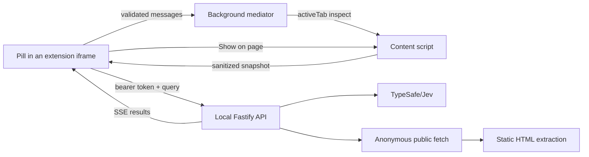

# Cmd-F

**Universal search for the site you're already on.**

Ask a question. Cmd-F finds where the answer is on this site — the paragraph, the setting, the docs page — and shows you the original text. Not a summary.

Open it with **Option+Shift+F** (Mac) or **Alt+Shift+F**. It looks at the current page first, then other public pages on the same site. It highlights only when you ask, and it never clicks or changes the page for you.

This is a local preview, not a Chrome Web Store listing. You run it on your own computer. Your AI keys stay on that computer, not in the extension.

<div align="center">

https://github.com/user-attachments/assets/26608da2-7f83-4229-9185-bc5d72d3c016

</div>

## Install and use

You need **Node 24.19+** (`.node-version` pins 24.21.0 LTS) and **pnpm 11.19.0**.

```bash
git clone https://github.com/ishuagrawal/Cmd-F.git
cd Cmd-F
pnpm install --frozen-lockfile
cp .env.example .env
```

Put your TypeSafe key in `.env`:

```dotenv
TYPESAFE_API_KEY=your-key
```

Cmd-F calls TypeSafe/Jev directly. There is no demo mode and no Vercel Gateway. The backend will not start without this key. Shell variables override `.env`. Restart the backend after changing it. See [configuration](docs/configuration.md) for the full variable list.

### Load the Chrome extension

```bash
pnpm build
pnpm dev:api
```

Keep the API running. Then:

1. Open `chrome://extensions`, enable **Developer mode**, and choose **Load unpacked**.
2. Select `apps/extension/dist` in this repository.
3. Open a normal `http` or `https` website (not a New Tab, settings page, or the Chrome Web Store).
4. Click the **Cmd-F** toolbar icon once so Chrome grants temporary tab access.
5. Press **Option+Shift+F** (Mac) or **Alt+Shift+F** to open the pill in the top-right corner. Change the shortcut at `chrome://extensions/shortcuts`. Escape closes it.
6. Type a question and press Enter or Send.

The unpacked build already includes this machine’s local connection token. Connection settings is only needed if the backend is offline or you replaced the token without rebuilding. Rebuild after changing `CMD_F_CLIENT_TOKEN` or deleting `.local/client-token`. After updating the extension, click **Reload** on `chrome://extensions`.

`pnpm package` writes `artifacts/cmd-f-extension.zip` for this machine. Extract it before Load unpacked.

### Search behavior

Enter submits; Shift+Enter inserts a newline. Default scope is **This site** (current page plus a bounded set of public subpages and relevant linked public sites). Choose **This page** in settings to stay on the tab.

Results can include verified source passages and labeled listings whose destination details are unverified. **Show on page** highlights a local passage, **Open listing** opens a matched link, and **Open source** opens a verified destination excerpt in a new tab. The browser’s normal Cmd+F / Ctrl+F is unchanged.

If Cmd-F opens a help page instead of the pill, the current tab cannot be inspected. Switch to a regular website and try again.

### Local playground

To try the UI against owned fixture pages without loading the extension:

```bash
pnpm demo
```

Open [http://127.0.0.1:5173/overlay.html](http://127.0.0.1:5173/overlay.html) for the pill, or [http://127.0.0.1:5173/sidepanel.html](http://127.0.0.1:5173/sidepanel.html) for the fixture playground. This uses the same TypeSafe key as the extension. `pnpm demo` can crawl those loopback fixtures; `pnpm dev` cannot. Never expose either development server to a network.

## How it works

Cmd-F is two programs that talk only on this machine.



**The extension** injects a small overlay host into the current tab. The chat UI runs in an extension-origin iframe, not in the website. A background worker is the only path to the page: it inspects the tab you invoked, sanitizes a snapshot (no passwords, drafts, or cookies), and later highlights a chosen passage. The extension has no blanket website permission, does not click controls, and cannot inspect `chrome://` pages.

**The local API** (`pnpm dev:api`, `127.0.0.1:4317`) owns the search. The extension authenticates with a machine-local token compiled in at `pnpm build`. The API never receives provider keys from the browser; your TypeSafe key stays in `.env` on the backend.

A search proceeds in bounded stages:

1. Classify the question (item, navigation, or information).
2. Inventory passages, controls, and safe links from the current snapshot.
3. Screen candidates with Jev Choice.
4. Independently verify exact source text for passages and controls. Matching links are shown as listings without claiming verified destination details.
5. If scope is This site, follow observed public links with DNS pinning, robots checks, and no browser cookies, then extract static HTML. Default budget is five successful public pages and 30 seconds.

Live results stream back over SSE. Closing the pill cancels the search and clears its highlight. Details: [architecture](docs/architecture.md), [security](docs/security.md), [privacy](docs/privacy.md).

## Commands

| Command             | Purpose                                                  |
| ------------------- | -------------------------------------------------------- |
| `pnpm dev`          | Public-policy API, Vite panel playground, owned fixtures |
| `pnpm demo`         | Public-site search plus owned local fixtures             |
| `pnpm dev:api`      | Public-policy loopback backend only                      |
| `pnpm build`        | Production unpacked extension and bundled Node backend   |
| `pnpm package`      | Build and zip the unpacked extension                     |
| `pnpm typecheck`    | TypeScript validation                                    |
| `pnpm lint`         | ESLint                                                   |
| `pnpm format:check` | Source formatting check                                  |
| `pnpm test`         | Unit, security, and API integration suites               |
| `pnpm test:e2e`     | Build and test the real extension in Chromium            |
| `pnpm test:eval`    | Deterministic evaluation report                          |
| `pnpm test:live`    | Opt-in Jev evaluation on the same corpus                 |

Browser tests inject a local mock provider. Stop a live preview first. Before the first run: `pnpm exec playwright install chromium`.

Live Jev quality is unmeasured; hosted identity, store distribution, and automatic quote relocation on newly opened tabs are deferred. See [decisions](docs/decisions.md) and [evaluation](docs/evaluation.md).

Released under the [MIT License](LICENSE).
