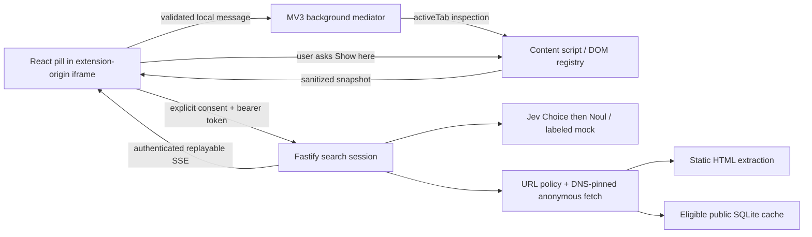

# Architecture

Cmd-F keeps discovery, semantic choice, and effects separate. Page content is data; it never becomes executable instructions.

## Ownership

- The content script retains element references locally. Candidate IDs are valid only in one immutable snapshot. A document ID survives inspections until navigation replaces the document. Reinspection creates a new snapshot ID.
- The background worker mediates extension-owned messages and tab access. It does not orchestrate a search or keep sensitive search state in globals. Worker termination does not reset the backend search.
- The panel pins each search to its source tab, previews data, gets consent, renews the lease, consumes events, and stops observing when the search ends. Tab navigation clears results; switching tabs does not retarget a highlight.
- The backend owns the deadline, provider budget, frontier, cache policy, and isolated session results. No website click capability exists in the API.

## Retrieval

Current-page evidence, route selection, and destination evidence are separate stages. Query ranking supplies bounded windows of 24 candidates, retaining lexical leaders and structurally spaced alternatives. Headings provide context rather than standalone evidence. Each page gets up to two candidate windows: an abstention advances to unseen candidates; a rejected selection is excluded before trying another passage. Jev checks selected evidence in a separate relevant/irrelevant call. No probability cutoff replaces that verdict.

Page context resolves the domain of short requests without locking searches to the starting page's topic. Destination metadata identifies the page under inspection. How-to results require actual instructions and explanatory results require concrete information. Navigation choices never count as verified evidence.

Discovery starts from observed same-origin links. Route ranking uses query relevance with modest title-subject and URL-path affinity. Jev can select among the leading routes; abstention or repeated malformed responses fall back to the highest-ranked unvisited URL. Newly fetched pages contribute links even when their evidence is rejected. Advertised robots sitemaps expand the frontier when it is empty or has no query-matching routes, avoiding unnecessary sitemap latency before promising observed links. URLs and content fingerprints are deduplicated. Fetches obey network/action policy and robots rules, with at least 500 ms between page starts.

Malformed provider responses get one retry at the failed selection or verification step, charged to the existing call/byte/time budgets. Validation diagnostics contain categories and field paths, never raw responses. Authentication, rate-limit, timeout, and budget errors remain explicit failures. Public result text is always copied from an independently verified immutable source record. Truncated passages cannot become results. Coverage reports inspected URLs and per-page outcomes, separating inaccessible pages, failed verification, and no accepted evidence.

## DOM source mapping

The extractor traverses up to 16,000 elements / 500 ms, records headings throughout the accessible traversal, surveys open shadow roots and same-origin frames, and builds a local section registry. Sanitized chosen candidates stay below the 80 KB request ceiling. Oversized or unsurveyed content is disclosed. Late-page passages can be selected locally by the current question; omitted sections are offered as bounded catalog groups. `READ_SECTION` accepts only registered section IDs and the current snapshot ID.

Passage highlights use a Range over the original element, preserving inline text nodes and code layout. Controls use a pointer-events-none outline; no focus or synthetic website event is dispatched. Before showing a source, the script rechecks the document URL, immutable snapshot, element connection, visibility, disabled state, and current text hash. A changed source fails rather than choosing an arbitrary repeated phrase. Quote relocation across a newly opened document is not implemented.

## API

All `/v1` routes require application authentication; search routes also verify ownership. `/healthz` is public and contains no secrets.

| Method | Path                        | Function                                      |
| ------ | --------------------------- | --------------------------------------------- |
| GET    | `/v1/config`                | Effective provider mode and disabled renderer |
| POST   | `/v1/searches`              | Consent-bearing initial snapshot and query    |
| GET    | `/v1/searches/:id`          | Current validated state                       |
| GET    | `/v1/searches/:id/events`   | SSE, `Last-Event-ID` replay                   |
| POST   | `/v1/searches/:id/snapshot` | Reinspect the same authorized document        |
| POST   | `/v1/searches/:id/lease`    | Renew panel lease                             |
| POST   | `/v1/searches/:id/cancel`   | Idempotent cancellation                       |
| DELETE | `/v1/searches/:id`          | Cancel and clear isolated session data        |

Events have protocol version 1, monotonically increasing IDs, search ID, type, and a validated state. The last 100 events are retained in memory. The client uses authenticated fetch streaming, so tokens never appear in event URLs. It retries interrupted streams up to three times and exposes reconnection. An API restart ends active sessions; recovery then returns a clear expired-search error.

## Budget defaults

5 public HTML page attempts, 5,000 discovered URL records, 10 sitemap attempts / 10 MB total decoded sitemap content, 2 MB per resource, 3 redirects, 8-second request timeout, 30-second active search deadline, 18 Jev calls including retry attempts, 1 MB total provider payload bytes, 4 local continuation steps, 45-second panel lease, 10-minute absolute retention. Limits nest; cancellation aborts in-flight network work and prevents new scheduling. User input pauses the active deadline but not absolute session expiry.

Public cache entries include response headers, retrieval time, and HTML. Keys include the normalized URL and extractor/anonymous request variant. Only eligible public responses enter SQLite, never snapshots or rankings. Cache expiry respects a 15-minute ceiling and restrictive response directives. Conditional ETag revalidation is deferred.

The toolbar action and keyboard shortcut inject a small overlay host into the current page. The host embeds `overlay.html` and resizes to its content. The background binds overlay inspection to `sender.tab.id`; requests cannot choose another tab. The production manifest does not register a Chrome side panel. The older `sidepanel.html` remains a development fixture interface.
