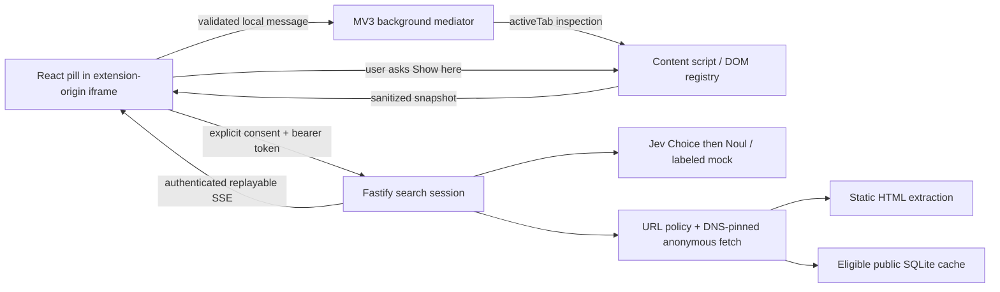

# Architecture

Cmd-F keeps discovery, semantic choice, and effects separate. Page content is data; it never becomes executable instructions.

## Ownership

- The content script retains element references locally. Candidate IDs are valid only in one immutable snapshot. A document ID survives inspections until navigation replaces the document. Reinspection creates a new snapshot ID.
- The background worker mediates extension-owned messages and tab access. It does not orchestrate a search or keep sensitive search state in globals. Worker termination does not reset the backend search.
- The panel pins each search to its source tab, previews data, gets consent, renews the lease, consumes events, and stops observing when the search ends. Tab navigation clears results; switching tabs does not retarget a highlight.
- The backend owns the deadline, provider budget, frontier, cache policy, and isolated session results. No website click capability exists in the API.

## Retrieval

One request first classifies the requested output as catalog items, navigation, or information. Information requests cannot produce link-title results; those links can only guide destination lookup. This prevents terse event queries from becoming bibliography links.

The remaining pipeline has four stages: an immutable candidate inventory, batched semantic screening, exact source verification, and a persistent URL frontier. Ranking determines examination order; no query token, lexical overlap threshold, or page region decides whether a live result is acceptable.

Each available passage, heading, control, and safe link can reach Jev. Candidates are scheduled in waves of 48. Each request contains at most 16 independent three-way Choice judgments: `match`, `route`, or `irrelevant`. Up to three requests run concurrently. Each question identifies its own candidate and shares the query and page context. Requests retain full extracted text and obey byte limits. The model is asked to distinguish item/navigation requests from factual and how-to requests. A link naming a requested item may be a match; a title cannot establish unseen facts such as salary. Multiple matching items do not compete in one exclusive Choice distribution.

Link matches become clearly labeled listings, copied from observed records. Passage/control matches still go through selection, exact sentence-span selection when needed, and independent relevance verification. The result quote and highlight use the same immutable span. Matching links remain visible while site search continues, and verified passages sort above listings. No lexical fallback becomes a live result. Model probabilities prioritize candidates; they are not displayed as calibrated answer accuracy.

The local DOM registry pages through omitted records, with no repeated candidates or model call spent choosing a generic section label. This-page scope never fetches destinations. Site scope follows a useful semantic route before requesting more local content; otherwise it reads more local sections. The frontier retains previously observed links across local continuations. Server-side HTML extraction no longer drops every candidate after a lexical top-500 cut.

Discovery starts with actual links, including public external destinations. Each target is fetched against its own origin's network and robots policy; redirects must stay within that origin. The root site's links can enter another origin, and that destination can recurse within its own origin, but cannot introduce a third origin. Depth is bounded to four. Fetched pages add outgoing links even when their own evidence is rejected. Previously screened routes reuse their judgments; unexamined routes are screened in waves. Advertised root-site sitemaps expand an empty or exhausted useful frontier. URL identities and content fingerprints are deduplicated. Fetches obey robots delay with a minimum 500 ms between starts on each origin. Failed attempts and successfully inspected pages have separate budgets.

Malformed responses receive one bounded retry. Validation records contain categories and paths, never raw source text. Provider failures retain existing results and expose a typed reason; cancellation aborts and joins all screening workers. Coverage separates observed links, candidates reviewed, crawl destinations, page fetches, inspected pages, and elapsed time. Limit exits disclose partial coverage rather than asking the user to compensate with a narrower query.

## DOM source mapping

The extractor traverses up to 16,000 elements / 500 ms, records headings throughout the accessible traversal, surveys open shadow roots and same-origin frames, and builds a local section registry. Sanitized chosen candidates stay below the 80 KB request ceiling. Oversized or unsurveyed content is disclosed. Late-page passages can be selected locally by the current question; omitted sections are offered as bounded catalog groups. `READ_SECTION` accepts only registered section IDs and the current snapshot ID.

Passage highlights use a Range over the original element, preserving inline text nodes and code layout. Controls use a pointer-events-none outline; no focus or synthetic website event is dispatched. Before showing a source, the script rechecks the document URL, immutable snapshot, element connection, visibility, disabled state, and current text hash. A changed source fails rather than choosing an arbitrary repeated phrase. Quote relocation across a newly opened document is not implemented.

## API

All `/v1` routes require application authentication; search routes also verify ownership. `/healthz` is public and contains no secrets.

| Method | Path                        | Function                                      |
| ------ | --------------------------- | --------------------------------------------- |
| GET    | `/v1/config`                | Effective provider mode and disabled renderer |
| POST   | `/v1/searches`              | Consent-bearing initial snapshot and query    |
| GET    | `/v1/searches/:id`          | Current validated state                       |
| GET    | `/v1/searches/:id/events`   | SSE, `Last-Event-ID` replay                   |
| POST   | `/v1/searches/:id/snapshot` | Reinspect the same authorized document        |
| POST   | `/v1/searches/:id/lease`    | Renew panel lease                             |
| POST   | `/v1/searches/:id/cancel`   | Idempotent cancellation                       |
| DELETE | `/v1/searches/:id`          | Cancel and clear isolated session data        |

Events have protocol version 1, monotonically increasing IDs, search ID, type, and a validated state. The last 100 events are retained in memory. The client uses authenticated fetch streaming, so tokens never appear in event URLs. It retries interrupted streams up to three times and exposes reconnection. An API restart ends active sessions; recovery then returns a clear expired-search error.

## Budget defaults

5 successful public HTML pages and up to 10 page fetch attempts, 5,000 discovered URL records, 10 sitemap attempts / 10 MB total decoded sitemap content, 2 MB per resource, 3 redirects, 8-second request timeout, 30-second active search deadline, 96 Jev requests including retries, 4 MB total provider payload bytes, up to 3 concurrent screening requests, 24 local continuation steps, 45-second panel lease, 10-minute absolute retention. Limits nest; cancellation aborts in-flight network work and prevents new scheduling. User input pauses the active deadline but not absolute session expiry.

Public cache entries include response headers, retrieval time, and HTML. Keys include the normalized URL and extractor/anonymous request variant. Only eligible public responses enter SQLite, never snapshots or rankings. Cache expiry respects a 15-minute ceiling and restrictive response directives. Conditional ETag revalidation is deferred.

The toolbar action and keyboard shortcut inject a small overlay host into the current page. The host embeds `overlay.html` and resizes to its content. The background binds overlay inspection to `sender.tab.id`; requests cannot choose another tab. The production manifest does not register a Chrome side panel. The older `sidepanel.html` remains a development fixture interface.
